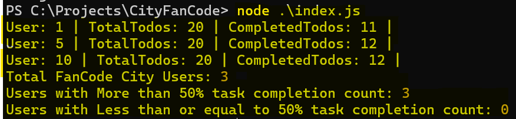

# CityFanCode
All the users of City `FanCode` should have more than half of their todos task completed.

# Install fnm(Fast Node Manager) using Powershell (Windows)
- `winget install Schniz.fnm`

- configure fnm environment: `fnm env --use-on-cd | Out-String | Invoke-Expression`

- download and install Node.js
`fnm use --install-if-missing 20`

- verifies the right Node.js version is in the environment
`node -v` # should print `v20.17.0`

- verifies the right npm version is in the environment
`npm -v` # should print `10.8.2`

# Install fnm (macOS)
- `curl -fsSL https://fnm.vercel.app/install | bash`

- activate fnm
`source ~/.bashrc`

- download and install Node.js
`fnm use --install-if-missing 20`

- verifies the right Node.js version is in the environment
`node -v` # should print `v20.17.0`

- verifies the right npm version is in the environment
`npm -v` # should print `10.8.2`

# Install fnm (Linux)
- `curl -fsSL https://fnm.vercel.app/install | bash`

- activate fnm
`source ~/.bashrc`

- download and install Node.js
`fnm use --install-if-missing 20`

- verifies the right Node.js version is in the environment
`node -v` # should print `v20.17.0`

- verifies the right npm version is in the environment
`npm -v` # should print `10.8.2`

# Run the application
- Clone this repo from `main` branch.
- Navigate to the `CityFanCode` directory.
- Run `npm install`.
- Run `node index.js` (Make sure you have installed fnm by following the above steps).
- The output would look like: 
